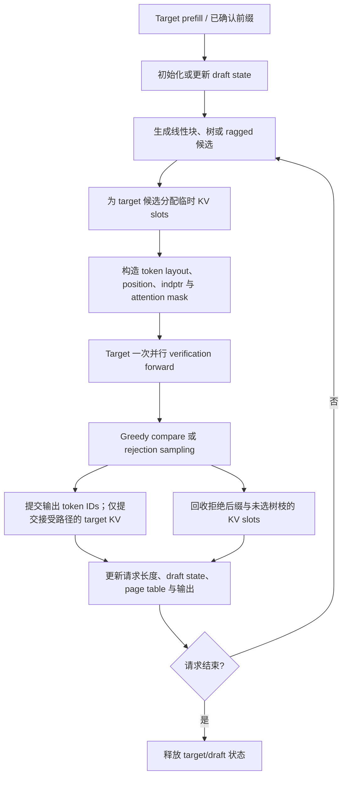

# 投机解码：算法、模型与推理系统

> 状态截至 2026-08-13。本文所称“无损”均指：在给定 target model、采样变换和硬件数值精度下，输出分布与直接从 target 采样一致。它不表示浮点结果逐 bit 相同。

## 1. 问题与结论

自回归模型一次 forward 通常只生成一个 token。低 batch decode 需要反复从 HBM 读取整套模型权重，常受显存带宽而非算力限制，GPU 的并行计算能力没有充分使用。

投机解码将一次生成拆成两步：

1. 较便宜的 **drafter** 提出多个未来 token。
2. **target model** 用一次多-token forward 并行验证候选，只提交满足 target 分布的最长前缀。

它减少的是串行 target forward 次数，不一定减少 FLOPs。加速成立需要同时满足：

- drafter 足够快；
- draft 与 target 足够一致；
- target 验证多个 token 明显快于逐 token 执行多次 decode；
- draft、采样、KV Cache 和调度开销没有抵消收益。

因此投机解码不是“免费加速”。它通常最适合低到中并发、target 较大、decode 受带宽限制、输出较可预测的场景。高并发时 target 已接近 compute-bound，额外验证 token 可能降低吞吐。

## 2. 标准算法

设 target 分布为 $p$，draft 分布为 $q$，draft 长度为 $\gamma$。给定已确认前缀 $x_{<t}$：

```text
draft:
  y_1 ~ q(. | x_<t)
  y_2 ~ q(. | x_<t, y_1)
  ...
  y_gamma ~ q(. | x_<t, y_<gamma)

verify:
  target 一次 forward 得到 p_1, ..., p_gamma, p_bonus
  从左到右接受候选，遇到第一次拒绝即停止
```

### 2.1 Greedy 验证

对每个位置比较：

$$
y_i \stackrel{?}{=} \arg\max_x p_i(x)
$$

相等则继续；第一次不等时丢弃该位置及其后缀，提交 target 的 argmax。若全部相等，再提交 target forward 已计算出的 bonus token。结果与 target greedy decoding 相同。

### 2.2 随机采样

候选 $y_i\sim q_i$ 的接受概率为：

$$
a_i(y_i)=\min\left(1,\frac{p_i(y_i)}{q_i(y_i)}\right)
$$

若 $u_i\sim U(0,1)$ 且 $u_i\le a_i(y_i)$，接受 $y_i$。第一次拒绝发生在位置 $i$ 时，从残差分布采样修正 token：

$$
p'_i(x)=\operatorname{norm}\left(\max(p_i(x)-q_i(x),0)\right)
$$

随后丢弃所有 draft 后缀。若 $\gamma$ 个候选全部接受，则再从 $p_{\gamma+1}$ 采样一个 bonus token。这个修正拒绝采样使每一步条件分布以及完整序列联合分布与直接从 target 采样一致。[Leviathan et al., 2023](https://proceedings.mlr.press/v202/leviathan23a.html) 与 [Chen et al., 2023](https://arxiv.org/abs/2302.01318) 独立给出了现代投机采样方法。

实现时必须保存每个候选位置的 $q_i$，并对 temperature、top-k、top-p 等变换后的 $p_i,q_i$ 执行接受规则。只比较采样出的 token 是否相等，不能保证随机采样无损。

### 2.3 为什么只能接受前缀

$p_i$ 和 $q_i$ 都以此前候选已被接受为条件。位置 $i$ 拒绝后，原候选 $y_{i+1}$ 的条件前缀已经失效。因此不能跳过拒绝位置后继续接受后缀。这是 rejection cascade 的根源。

### 2.4 速度模型

若各位置条件接受率近似为 $\alpha$，一轮平均接受的 draft token 数为：

$$
\mathbb{E}[A]=\sum_{i=1}^{\gamma}\alpha^i
$$

加上必然输出的修正或 bonus token，一轮平均发射：

$$
\mathbb{E}[L]=\sum_{i=0}^{\gamma}\alpha^i
=\frac{1-\alpha^{\gamma+1}}{1-\alpha}
$$

单位置的理论接受率满足：

$$
\alpha=\sum_x\min(p(x),q(x))
=1-\operatorname{TV}(p,q)
$$

实际每 token 延迟近似为：

$$
T_{\text{token}}
=\frac{T_{\text{draft}}(\gamma)+T_{\text{verify}}(B,V)+T_{\text{runtime}}}
{\mathbb{E}[L]}
$$

$B$ 是活跃请求数，$V$ 是本轮总验证 token 数。真实 $T_{\text{verify}}$ 随模型、batch、上下文、候选树、kernel 和并行配置变化，不能视为常数。

本文后续统一使用：

- **accepted draft tokens**：一轮通过验证的 draft token 数，不含修正/bonus token；
- **emitted tokens per cycle**：一轮最终提交的 token 数，包含修正/bonus token；
- **acceptance rate**：需注明是逐 token、逐位置还是整块接受率。

## 3. 设计空间

### 3.1 Drafter 来源

| 类别 | 代表方法 | 主要优点 | 主要代价 |
|---|---|---|---|
| 独立小语言模型 | 经典 speculative sampling、DistillSpec | 可复用现有小模型；线性候选简单 | 需要额外权重和 KV；tokenizer/分布可能不匹配 |
| 自投机 | Draft & Verify、LayerSkip | 共享主模型参数；少一套模型 | 浅层输出质量有限；常需训练或逐模型选层 |
| 检索与匹配 | LLMA、REST、prompt lookup、n-gram/suffix | 无神经 drafter；重复文本上便宜 | 收益依赖输入或语料重叠 |
| 多预测头 | Blockwise、Medusa、Hydra、并行 MTP | 一次产生多个位置/分支 | 各位置独立时缺少块内条件依赖 |
| Feature drafter | EAGLE 系列 | 复用 target hidden，draft-target 对齐较好 | 需配套训练；target 耦合强 |
| 原生顺序 MTP | DeepSeek-V3 MTP | 与 target 联合训练；共享 embedding/head | checkpoint 必须原生包含；draft 仍有顺序依赖 |
| 并行 block drafter | DFlash | 一次 forward 生成整块 | 独立位置产生 suffix decay |
| 半自回归 block drafter | DSpark | 并行主干兼顾块内依赖 | 模型和系统调度更复杂 |

### 3.2 候选拓扑

**线性 block** 只提出一条长度为 $\gamma$ 的路径。验证简单，但前部一次错误会丢弃整个后缀。

**Token tree** 在每层保留多个候选，增加至少一条路径命中 target 的概率。树可在物理张量中 flatten，但每个节点只能看到共享前缀和自己的祖先；兄弟节点不能互相注意。position id 由树深度决定，而不是 flatten 后的数组下标。

**动态树** 根据当前上下文的 draft confidence 分配节点预算。树越大通常接受得更多，但 target 要验证更多节点，临时 KV、LM head 和采样成本也增加。

**Ragged block** 为同一 batch 内不同请求选择不同验证长度，再沿 token 轴紧凑打包。逻辑边界由 `cu_seqlens`、`qo_indptr`、position 和 mask 表达。

### 3.3 正确性等级

| 表述 | 准确含义 |
|---|---|
| 分布无损 | 使用精确修正拒绝采样，最终分布等于 target |
| Greedy 一致 | temperature=0 时 token 序列与 target argmax 相同 |
| 质量近似不变 | 任务指标或人工评价接近，但分布已经改变 |
| 近似接受 | typical/阈值/lenience 等规则扩大接受范围，以质量换速度 |

论文或实现声称“lossless”时，必须核对它使用哪种接受规则。Medusa 的严格 rejection sampling 可以无损；typical acceptance 不是原分布无损。

## 4. 发展过程

| 时间 | 工作 | 核心推进 |
|---|---|---|
| 2018 | [Blockwise Parallel Decoding](https://arxiv.org/abs/1811.03115) | 多个 offset head 并行预测未来 token，再接受 target 认可的最长前缀 |
| 2022-03 | [SpecDec](https://arxiv.org/abs/2203.16487) | 专门训练 drafter 与并行 verifier，主要面向 greedy/seq2seq |
| 2022-11 / 2023 | [Fast Inference via Speculative Decoding](https://proceedings.mlr.press/v202/leviathan23a.html) | 给出保持 target 分布的修正拒绝采样与速度分析 |
| 2023-02 | [Speculative Sampling](https://arxiv.org/abs/2302.01318) | 独立提出同类精确采样算法并在分布式大模型上验证 |
| 2023-04 | [LLMA](https://arxiv.org/abs/2304.04487) | 从 reference 文本复制候选 span，适合 RAG 与文本改写 |
| 2023-05 | [SpecInfer](https://arxiv.org/abs/2305.09781) | 多 drafter token tree 与 tree-based parallel verification |
| 2023-09 | [Draft & Verify](https://arxiv.org/abs/2309.08168) | 跳过 target 的部分中间层完成 self-speculation |
| 2023-10 | [DistillSpec](https://arxiv.org/abs/2310.08461) | 用 on-policy 蒸馏和任务相关散度提高 draft-target 对齐 |
| 2023-11 | [REST](https://arxiv.org/abs/2311.08252) | 从外部 datastore 检索 continuation 并以树验证 |
| 2024-01 | [Medusa](https://arxiv.org/abs/2401.10774) | 在 target hidden 上增加多个未来 token head，以树组织候选 |
| 2024-01 | [EAGLE](https://arxiv.org/abs/2401.15077) | 在 feature 层自回归，并用 shifted token 消除采样不确定性 |
| 2024-02 | [Lookahead Decoding](https://arxiv.org/abs/2402.02057) | Jacobi 迭代并行收集、验证 n-gram，无独立 drafter |
| 2024-02 | [Hydra](https://arxiv.org/abs/2402.05109) | 让多预测头显式依赖此前候选，缓解 Medusa 头间独立 |
| 2024-02 | [Sequoia](https://arxiv.org/abs/2402.12374) | 动态规划设计 token tree，并按硬件实测代价选择树 |
| 2024-04 | [LayerSkip](https://arxiv.org/abs/2404.16710) | layer dropout 与 early-exit loss 支持浅层 self-drafter |
| 2024-04 | [Multi-Token Prediction](https://arxiv.org/abs/2404.19737) | 将多未来 token 预测作为训练目标和推理候选来源 |
| 2024-06 | [EAGLE-2](https://arxiv.org/abs/2406.16858) | 用 context-aware confidence 动态构造 draft tree |
| 2024-08 | [MagicDec](https://arxiv.org/abs/2408.11049) | 分析长上下文、高 batch 下 KV 瓶颈，并使用稀疏 draft KV |
| 2024-12 | [DeepSeek-V3](https://arxiv.org/abs/2412.19437) | 顺序 MTP module 联合预训练，并作为原生 drafter |
| 2025-03 | [EAGLE-3](https://arxiv.org/abs/2503.01840) | 多层 feature fusion、直接 token 目标和 training-time test |
| 2026-02 | [DFlash](https://arxiv.org/abs/2602.06036) | block diffusion drafter 一次 forward 并行产生候选块 |
| 2026-07 | [DSpark](https://arxiv.org/abs/2607.05147) | 半自回归 block drafter 与按请求、按负载的验证调度 |

这条路线的主线不是单纯扩大 drafter：研究重点逐渐从“提出候选”扩展到 draft-target 对齐、树/块结构、训练分布偏移、KV 生命周期，以及高并发下的验证预算。

## 5. EAGLE 系列

### 5.1 EAGLE-1：Feature Autoregression

EAGLE 预测 target 倒数第二层，即 LM head 之前的 feature，而不是直接用一个小 LM 预测 token。主要观察是：feature 自回归比 token 自回归更容易对齐 target，但 feature 本身不能唯一确定此前实际采样了哪个 token。

EAGLE 将向前错一位的真实 token embedding 一同输入 drafter：

```text
target features: f_1, ..., f_t
shifted tokens:  t_2, ..., t_(t+1)
                    |
             FC + one decoder layer
                    |
              predict f_(t+1)
                    |
          frozen target LM head -> q_(t+1)
```

shifted token 显式告诉 drafter 上一步实际选择了什么，消除“相同 feature 分布对应不同已采样 token”的不确定性。训练包含 feature regression 与 token classification/distillation。推理时多步自回归地产生 feature/token，组成固定 token tree，再由 target 使用 tree attention 一次验证。

### 5.2 EAGLE-2：动态树

EAGLE-2 不更换 EAGLE-1 drafter，也不要求重新训练。它改变候选树的预算分配：

1. 以 draft token probability 估计局部接受率。
2. 节点 path score 为祖先 confidence 的乘积。
3. 优先扩展高 path score 的 frontier。
4. 在固定节点预算下保留最可能通过的连通子树。

所以 EAGLE-2 是树构造策略，不是新的预测模型。SGLang 配置中的 `EAGLE` 通常指 EAGLE feature drafter 加 EAGLE-2 动态树。

### 5.3 EAGLE-3：直接 token 目标

EAGLE-3 取消的是 **feature regression 约束**，不是完全不使用 target feature。它融合 target 低、中、高层 hidden state，直接优化 draft token 分布。

原 EAGLE 训练主要看到真实 target feature，但多步推理会回灌 drafter 自己产生的 latent，存在 exposure shift。EAGLE-3 的 training-time test 在训练中展开并模拟后续 draft step，把 drafter 自己输出的 latent 回灌为下一步输入，使训练上下文接近推理上下文。

主要变化是：

- top-layer feature 改为多层 feature fusion；
- feature regression 改为直接 token distillation；
- 训练时模拟多步 draft；
- 候选仍可结合 EAGLE-2 动态树验证。

论文报告的最高 `6.5x` 是特定模型、任务和 batch=1 实验上限；其 SGLang 实验在 batch size 64 报告约 `1.38x` throughput。它们不能作为任意部署的默认收益。

## 6. MTP：训练目标与推理 drafter

MTP 首先是一种训练目标：在位置 $t$ 不只预测 $x_{t+1}$，还预测更远的未来 token。它是否能加速推理，取决于是否把这些预测接入 target verification。

### 6.1 并行多头 MTP

[Gloeckle et al.](https://arxiv.org/abs/2404.19737) 在共享 model trunk 上放置 $D$ 个独立输出 head：

$$
h_t \rightarrow \{q(x_{t+1}),q(x_{t+2}),...,q(x_{t+D})\}
$$

所有 head 可并行执行，但远端 head 没有显式看到前面实际选择的 token，因此可能产生块内不一致。Medusa 属于相近设计，并进一步用 top-k 笛卡尔积构造候选树。

### 6.2 DeepSeek-V3 顺序 MTP

DeepSeek-V3 使用顺序 MTP module。训练时，第 $k$ 个 module 接收前一深度 hidden 与 teacher-forced 的第 $k$ 个未来 token embedding，经归一化、拼接、投影和一个 Transformer block，预测再下一个 token：

$$
h_i^{(k)}=\operatorname{TRM}_k\left(
M_k\left[\operatorname{RMSNorm}(h_i^{(k-1)});
\operatorname{RMSNorm}(\operatorname{Emb}(x_{i+k}))\right]
\right)
$$

embedding 和 LM head 与主模型共享，各深度使用交叉熵监督。作为 speculative drafter 推理时，真实未来 token 不可知，第 $k$ 个 module 改为输入前一 MTP 步实际提出/采样的 token。与并行独立 head 相比，顺序 module 因而保留完整条件链；代价是 draft latency 随步数增长。

公开 DeepSeek-V3 权重包含一个 MTP module。官方权重说明给出的口径是 `11.5B unique parameters`，不含共享 embedding 和 output head；`activation parameters` 为 `2.4B`，其中包含共享 embedding 和 output head 各 `0.9B`。共享部分不构成额外权重开销。[权重结构](https://github.com/deepseek-ai/DeepSeek-V3/blob/main/README_WEIGHTS.md)

DeepSeek-V3 报告中，第二 token 的接受率为 `85%-90%`，并报告 `1.8x TPS`。这是其模型和部署条件下的结果。MTP 候选仍需主模型验证，不能直接无条件提交。

### 6.3 与 EAGLE 的区别

| 维度 | DeepSeek-V3 MTP | EAGLE-3 |
|---|---|---|
| 训练时机 | 与 target 联合预训练 | 通常冻结既有 target 后训练外挂 drafter |
| 条件输入 | 前一 MTP hidden + future token embedding | target 多层 feature + 已采样 token + draft latent |
| 结构 | 顺序 MTP module | 轻量 feature-conditioned drafter |
| 权重适配 | checkpoint 原生包含 | 每个 target 通常需要配套 checkpoint |
| 验证 | target speculative verification | target tree verification |

## 7. DFlash 与 DSpark

### 7.1 DFlash：并行 block drafter

DFlash 用轻量 block diffusion model 一次 forward 预测整个候选块。它从 target 多层 hidden 提取 context feature，并把投影后的 context 注入 drafter 各层 K/V；这部分状态可缓存在 drafter KV 中。

```text
target context features
       -> fuse/project -> persistent draft K/V

anchor token + masked positions
       -> block diffusion drafter
       -> q_1, q_2, ..., q_gamma in one forward
```

它将 $T_{\text{draft}}$ 从随 $\gamma$ 线性增加改为近似一次并行 pass，因此可以使用更深的 drafter 和更长的 block。问题是各位置没有看到块内其他位置最终采样的 token；存在多种合理续写时，独立边缘预测可能组合成不连贯序列，接受率沿后缀快速下降。

论文报告的 `>6x` 和相对 EAGLE-3 的结果来自其指定模型、任务、block size 与单请求设置，不代表在线高并发吞吐。

### 7.2 DSpark：半自回归 drafting

DSpark 在 DFlash 式并行 backbone 后增加很轻的顺序模块：

1. parallel backbone 一次产生整块 hidden $h_k$ 和 base logits $U_k$；
2. 顺序 head 根据已采样的块内前缀，为 $U_k$ 加 transition bias；
3. confidence head 预测每个位置在此前位置已接受条件下的存活率；
4. scheduler 只选择有正收益的前缀交给 target 验证。

Markov head 只依赖前一个 token，并用低秩矩阵近似 $V\times V$ 转移：

$$
B(x_{k-1},\cdot)=W_1[x_{k-1}]W_2
$$

论文默认 rank 为 256。RNN head 维护块内 recurrent state，可以利用完整前缀，但执行和部署更复杂。两者的目标都是用很小的串行开销缓解并行 drafter 的 suffix decay。

### 7.3 Confidence-scheduled verification

confidence head 输出：

$$
c_{r,k}=P(\text{位置 }k\text{ 接受}\mid\text{此前位置全部接受})
$$

请求 $r$ 的长度 $j$ 前缀存活率为：

$$
a_{r,j}=\prod_{i=1}^{j}c_{r,i}
$$

训练目标使用 draft 与 target 分布的总变差得到解析接受率：

$$
c^*_{r,k}=1-\frac{1}{2}\|p^d_{r,k}-p^t_{r,k}\|_1
$$

原始 confidence 还要通过 Sequential Temperature Scaling 校准累计存活概率。调度器预先 profile 引擎的 `SPS(B)` 或 step-time 曲线，然后在增加验证 token 的预期收益与边际成本之间选择每个请求的验证长度 $\ell_r$。

高并发时这是关键：若有 $R$ 个请求且每个验证 $K$ 个 draft token，target 工作量从约 $R$ 个 query 扩大到 $R(K+1)$。被首个错误丢弃的低置信度后缀占用了本可服务其他请求的 batch capacity。

调度决策还必须是 non-anticipating：是否纳入第 $k$ 个候选，必须在观察或采样该候选 $x_k$ 前决定；不能让由 $x_k$ 导出的后续 confidence 反过来影响它自身是否被验证，否则会产生 selection bias，破坏 target 分布。DSpark 论文使用 early stopping；异步生产路径使用滞后的 confidence 信号建立因果屏障。

### 7.4 已知边界

- confidence 截断只节省 target verification；parallel backbone 已经生成整块，draft 成本不能回收。
- 低接受率请求仍支付固定 draft 成本。
- cost table 与硬件、模型、精度、batch、上下文和 kernel 强耦合。
- 论文在 DeepSeek-V4 实流量、matched throughput 下报告：V4-Flash 单用户速度提升 `60%-85%`，V4-Pro 提升 `57%-78%`，对照为 MTP-1。极端 SLA 下更大的数字来自基线 throughput cliff，不是通用倍数。

## 8. 从候选到 Kernel 的完整实现

### 8.1 运行链路



### 8.2 不是普通 concat

线性候选可以作为 `[sum verify_len]` 紧凑 tensor 传入 target，但逻辑上仍是多个独立请求。常见 autoregressive runtime 中，最后一个已输出 token 是尚未写入 target KV 的 `pending_anchor`；若其后提出 $K$ 个候选，请求的验证段通常是：

```text
req_r segment = [pending_anchor, draft_0, ..., draft_(K-1)]
tokens        = concat(req_0_segment, req_1_segment, ...)
qo_indptr     = [0, len_0, len_0 + len_1, ...]
positions     = 每个请求从其 target cached_len 开始
page table = 每个请求自己的 prefix + 临时候选槽位
```

anchor 行的 target logits 验证 `draft_0`，`draft_i` 行验证 `draft_(i+1)`，最后一行产生 bonus logits。因此提出 $K$ 个候选通常要 forward $K+1$ 个 token，而不是只 forward $K$ 个 draft token。只有另行预计算并保存 anchor logits/KV 的设计才能改变这个对齐关系。

跨请求的 `concat` 只做物理紧凑打包，不会将请求拼成一条文本。varlen attention kernel 通过 `indptr`、sequence length 和 page table 分隔请求。

树候选同样可以 flatten，但还必须传 tree mask 或等价的 parent/ancestor metadata：

```text
root
├── A
│   ├── C
│   └── D
└── B
    └── E
```

节点 `D` 只能看到正式 prefix、`A` 和自己，不能看到 `B/C/E`。若把 flatten 后的 `[A,B,C,D,E]` 当普通 causal sequence，`D` 会看到错误兄弟节点，logits 和 KV 都不再正确。

### 8.3 KV Cache 生命周期

一次验证通常需要 lookahead slots：

```text
正式 target KV: [committed prefix........................]
临时 verify KV:                                      [anchor d0 d1 ...]
                                                           |
verification 后仅提交 anchor 与接受路径 ------------------+
其余 slots free / rewind / remap
```

实现可选择：

- 先写入请求页表尾部，验证后截断长度并回收尾页；
- 使用独立临时槽位，接受后将选中路径映射进正式页表；
- 预留固定 lookahead region，按请求记录 committed length。

关键不变量是：下一轮 attention 只能读取已提交 token 的 KV。拒绝后缀和未选树枝不能留在逻辑序列中。

还要区分“token 已输出”和“其 target KV 已物化”。设验证前已有已提交 KV 前缀 $P$、尚未写 KV 的末 token $a$，drafter 提出 $d_0,\ldots,d_{K-1}$。target verification 输入 `[a,d_0,...,d_(K-1)]`，为 anchor 和候选写入临时 KV。若接受前 $j$ 个候选，提交 $a,d_0,\ldots,d_{j-1}$ 的 KV；本轮 correction/bonus token $z$ 只从 logits 得到，尚未作为 target 输入：

```text
logical tokens: P + a + accepted drafts + z
target KV:      P + a + accepted drafts
                                          ^ 下一轮将 z 作为新的 pending anchor
```

因此 decode 运行时经常保持一个 token 的逻辑长度与 KV 长度差。mini-SGLang 的请求完成 prefill、进入 decode 队列后，`complete_one()` 使其稳定满足 `cached_len = device_len - 1`，正好表示末 token 等待下一次 forward。新请求或 chunked prefill 的 `extend_len` 可以大于 1，不能把这个等式当作所有阶段的不变量。若实现选择额外 forward 最后一个 token，也可以立即物化其 KV，但这会增加一次 target 计算。

drafter 状态取决于方法：

- 独立小 LM 有自己的 KV Cache，拒绝后也要回滚到已提交前缀；
- EAGLE 维护 target feature 与 draft KV，token/feature 存在一步错位；
- MTP 复用主模型 hidden、embedding/head，但 module 状态仍需与接受长度同步；
- DFlash/DSpark 缓存注入的 target context feature，块内临时状态不应污染下一轮。

### 8.4 连续批处理

同一轮每个请求可能接受不同数量：

```text
req A: draft 6, accept 5 -> emit 6
req B: draft 3, accept 0 -> emit 1
req C: draft 5, accept 2 -> emit 3
```

请求在轮末分别增加 `6/1/3` 个 token。下一轮 scheduler 根据更新后的长度、剩余输出预算和 KV 页重新组成 batch；请求可以完成、退出，也可以有新请求进入。这仍是 continuous batching，只是“每轮每请求固定推进 1 token”变成了 ragged advancement。

调度器至少要维护：

- 本轮 draft/verify 阶段；
- 每请求 proposed、scheduled、accepted、committed 长度；
- target 与 draft 的临时 KV 所有权；
- verify token budget，而不只是 request count；
- abort、EOS、`max_tokens` 在一轮多 token 输出中的截断；
- overlap 时跨轮 confidence、future 和资源释放顺序。

### 8.5 CUDA Graph

普通 decode graph 常固定为 `[batch, q_len=1]`。投机验证同时改变 batch、每请求 query length、总 token 数和树结构。常见方案是：

- 固定 `(batch, draft_len, tree_shape)` capture，多余位置 padding；
- 按总验证 token 数 capture buckets；
- 将 ragged token 前向紧凑打包，再向最近 graph tier padding；
- 为 tree metadata、page table、positions、draft probs 使用持久 device buffer。

SGLang 的 DSpark 开发/固定提交复现路径按 ragged 总 token 数选择 graph tier，因此缩短验证窗口会实际减少 target 的 MLP/attention 行数，而不是只在固定宽度 graph 中加 mask。[SGLang DSpark 实现说明](https://www.lmsys.org/blog/2026-07-06-dspark-sglang/)

### 8.6 并行与其他特性

- **TP**：target 和 neural drafter 各自按层切分；LM head 的全词表概率、top-k 和 rejection sampling 需要正确 collective。
- **DP/DP Attention**：各 rank 请求数和 verify token 数可能不同；graph tier、采样结果和调度反馈需要一致。
- **EP/MoE**：候选 token 增多会改变 expert routing 负载和 all-to-all 形状。
- **Paged/Radix Cache**：prefix hit 只覆盖正式前缀；临时候选不能提前插入共享 radix tree。
- **Chunked prefill**：prefill、draft、verify 争用 token budget；框架需要明确能否混批。
- **Overlap scheduling**：调度下一轮时当前轮结果未回到 CPU，需 device-side 状态或滞后反馈。
- **Structured output**：draft 与 target 必须使用同一 grammar mask；接受后 grammar state 按实际提交 token 推进。

## 9. 工业框架现状

框架变化很快。下表只描述截至本文日期的主线能力，不代表所有模型、后端和并行组合都成熟。

| 系统 | 主要能力 | 需要注意 |
|---|---|---|
| [SGLang](https://docs.sglang.io/docs/advanced_features/speculative_decoding) | 主线文档列出 EAGLE-2/3、MTP、DFlash、standalone、n-gram；DSpark 的 dev/pinned 路径已集成 ragged verify、confidence scheduling、CUDA Graph 和 overlap | DSpark 仍在完善组合覆盖；其他算法对 DP Attention、PP、chunked prefill 和 backend 也有限制 |
| [vLLM](https://docs.vllm.ai/en/latest/features/speculative_decoding/) | draft model、EAGLE、MTP、MLP、n-gram、suffix、动态 speculation；共享 speculative metadata 与 rejection sampling 基础设施 | DSpark drafting 与按请求 confidence scheduling 的覆盖需按版本和模型路径核对 |
| [TensorRT-LLM](https://github.com/NVIDIA/TensorRT-LLM/blob/main/docs/source/features/speculative-decoding.md) | DraftTarget、EAGLE、MTP、n-gram、并行 draft 等硬件优化路径 | 算法存在于 main 不等于稳定 release 的所有组合可用 |
| [Transformers](https://huggingface.co/docs/transformers/main/en/generation_strategies#speculative-decoding) | assistant model、prompt lookup、early-exit self speculation、Universal Assisted Generation | 适合单机生成 API；batched/在线调度能力不同于 serving engine |
| [DeepSpec](https://github.com/deepseek-ai/DeepSpec) | DSpark、DFlash、EAGLE-3 的数据准备、target cache、训练和 acceptance 评测 | “full-stack”指 draft 训练评测链，不是完整在线 serving engine |
| [SpecForge](https://github.com/sgl-project/SpecForge) / [vLLM Speculators](https://docs.vllm.ai/projects/speculators/en/latest/) | 训练、转换和部署 EAGLE/MTP/DFlash/DSpark 等 speculator | 数据生成与 target feature cache 成本高，checkpoint 与 target 强耦合 |

vLLM 的 [`RejectionSampler`](https://github.com/vllm-project/vllm/blob/main/vllm/v1/sample/rejection_sampler.py) 是理解工程实现的直接入口：输入 flatten 后的 draft probs、target logits 和 speculative metadata，输出 accepted、recovered 与 bonus tokens。

## 10. mini-SGLang 的现状与接入边界

本文基于 mini-SGLang 提交 `f675880`。当前主线没有投机解码。`python/minisgl/models/qwen3_5_ref.py` 中过滤 `mtp` 权重的代码属于参考模型文件，不构成可执行 MTP 推理链。

### 10.1 当前代码假设

| 当前代码 | 假设 | 投机解码需要的变化 |
|---|---|---|
| [`core.py`](../python/minisgl/core.py) `Batch.phase` | 只有 prefill/decode | 增加 draft/verify 语义或独立 speculative metadata |
| [`core.py`](../python/minisgl/core.py) `Req.complete_one()` | 每次 Engine forward 都无条件标记现有输入已缓存、再预留一个位置；每个非 chunk 请求只采样一个 token | draft/verify 不能继续无条件调用；应按每请求 committed length 更新，处理 EOS/max_tokens 中途截断 |
| [`scheduler/decode.py`](../python/minisgl/scheduler/decode.py) | 所有 running request 组成单 token decode batch | 为 draft、verify 分配 token budget 和 lookahead KV |
| [`scheduler/scheduler.py`](../python/minisgl/scheduler/scheduler.py) | 每请求只写一个 next token | 一次回传 ragged token 列表、接受长度和 KV commit 信息 |
| [`engine/sample.py`](../python/minisgl/engine/sample.py) | 每请求一行 logits，直接 greedy/采样 | 保存 draft probs；实现 greedy verify 与 residual rejection sampler |
| [`layers/embedding.py`](../python/minisgl/layers/embedding.py) | decode 对所有 hidden 运行 LM head，prefill 只取末位 | verify 需要为候选节点选择对应 logits；树需节点到 logits 映射 |
| [`engine/graph.py`](../python/minisgl/engine/graph.py) | graph 只 capture decode，固定 `q_len=1` | capture draft/verify buckets 或 ragged total-token tiers |
| [`attention/fa.py`](../python/minisgl/attention/fa.py)、[`attention/fi.py`](../python/minisgl/attention/fi.py) | eager prefill 已支持按 `extend_len` 的线性 ragged query；graph decode 固定 `q_len=1`；没有 tree mask | 线性 verify 可复用 prefill metadata，但需增加 verify/LM-head 路由；graph 支持多 query，树形路径新增 ancestor mask 契约 |
| [`scheduler/cache.py`](../python/minisgl/scheduler/cache.py) | 按 `device_len` 分配正式页，完成后统一缓存/释放 | 增加临时候选槽、commit/rollback，禁止候选提前进入 Radix Cache |

### 10.2 最小接入方案

建议先实现线性、greedy、独立 draft model 的单 GPU 版本，再扩展随机采样和树。它不能直接在当前 `Engine` 中再实例化一个模型：`Context` 是只允许设置一次的全局单例，且绑定唯一 KV Cache、page table 和 attention backend。低开销实现应先把它改成可切换的 model-local context，再为 draft model 建立独立 KV/page table/backend；另一种隔离方案是独立 draft worker 进程，但会增加 CUDA context 和通信开销。

当前 scheduler 每轮也只发起一次 `_forward()`，`ForwardOutput`、token pool 写回和 detokenize 消息均为单 token 形状。因此还需把 decode loop 改为 `draft -> verify -> commit` 阶段状态机。最小结构为：

```text
SpecConfig
  method, draft_model_path, num_spec_tokens

Req.spec_state
  draft_len, verify_len, accepted_len
  draft_cache_handle, temporary_target_slots

SpecWorker
  draft(reqs) -> draft_token_ids, draft_probs
  build_verify_batch(...)
  verify(target_logits, ...) -> committed_token_ids, accepted_lens

Scheduler
  allocate lookahead slots
  run draft -> target verify
  commit accepted KV / free rejected KV
  emit ragged results
```

对 mini-SGLang 当前的 decode 状态，线性 verify batch 不能只放 draft token。验证前通常满足 `cached_len = device_len - 1`，因此要先取请求末尾的 `pending_anchor`，构造 `[pending_anchor, draft_0, ..., draft_(K-1)]`，并分配 $K+1$ 个 target KV 槽。验证后提交 anchor 与接受 draft 的 KV，correction/bonus 成为新的 pending anchor。若省略 anchor，第一候选没有对应的 target logits，position 与 KV 也会整体错一位。

一次投机轮会给每个请求返回不同数量的 token；除 Scheduler 外，还要把 `ForwardOutput.next_tokens_*`、device token pool 写回、`DetokenizeMsg.next_token` 改为 ragged 结果，并在流式输出、EOS 和 `max_tokens` 处截断。

实现顺序：

1. 只支持 greedy、固定线性 draft length、eager forward、`page_size=1`。
2. 建立 token equality、KV commit/rollback 和资源守恒测试。
3. 加入精确随机 rejection sampling，并做分布统计检验。
4. 加入 paged lookahead slots、continuous batching、abort/EOS。
5. 增加 CUDA Graph buckets 与 overlap。
6. 最后实现 EAGLE tree 或 MTP，避免同时引入模型和系统两类变量。

树形 EAGLE 不能复用现有普通 causal metadata，需要新的 tree attention backend 契约。DSpark 还需要 per-request ragged verify、confidence calibration 和硬件 cost table，明显不适合作为第一条实现路径。

## 11. 性能、价值与选型

### 11.1 何时有价值

- 大 target、batch 较小，单 token decode 明显受权重带宽限制；
- 代码、数学模板、固定格式等低熵输出，draft-target 重合高；
- 有与 target、领域和采样配置对齐的 draft checkpoint；
- 延迟比峰值吞吐更重要，或者系统能动态收缩验证预算；
- 模型使用昂贵 TP/EP，减少串行 target step 可降低每 token collective 次数。

### 11.2 何时可能变慢

- 高 QPS 下 target 已 compute-bound；
- target 很小，单步本来就快；
- 开放式文本、高温采样或 domain shift 导致接受率低；
- draft 太大、跨设备通信或 tokenizer 转换开销高；
- tree/block 太大，LM head、attention、KV 和 sampling 开销超过收益；
- graph/backend 不支持多 token verify，只能退回低效 eager 路径。

### 11.3 简单选型

| 条件 | 优先尝试 |
|---|---|
| checkpoint 原生包含 MTP，且框架支持该模型的 native MTP | MTP；通常集成改动最少 |
| 普通 target 有成熟配套 checkpoint | EAGLE-3；兼顾接受长度和生态支持 |
| 高并发且固定长块浪费严重 | DSpark 或其他动态 verify length 方法 |
| prompt/输出高度重复且无训练预算 | prompt lookup、n-gram、suffix 或 REST |
| 不能加载第二套模型 | self-speculation、LayerSkip、Lookahead |
| 需要最容易验证的教学实现 | 小 draft model + 线性 speculative sampling |

## 12. 评测方法

### 12.1 必报指标

- draft acceptance rate 和分位置接受率；
- accepted draft tokens 与 emitted tokens per cycle；
- draft、target verify、sampling、scheduler 分项 latency；
- TTFT、TPOT/ITL、端到端 latency 与 p50/p95/p99；
- aggregate throughput、goodput 和达到的并发；
- target verified tokens、rejected tokens 和验证利用率；
- target/draft 权重、KV、临时候选和 CUDA Graph 峰值显存。

只报告平均接受长度不足以证明加速。至少同时给出硬件、模型与精度、draft 配置、batch/QPS、输入/输出长度、数据集、temperature/top-k/top-p 和 baseline 版本。

### 12.2 正确性矩阵

| 测试 | 验证目标 |
|---|---|
| greedy no-spec vs spec | 全部 token IDs 完全相同 |
| sampling 大样本频率 | rejection sampler 输出收敛到 target 分布 |
| 全接受/首 token 拒绝/中途拒绝 | correction、bonus 和后缀丢弃正确 |
| 跨 page 边界 | commit/rollback 后 page table 与 KV 正确 |
| batch 内不同接受长度 | ragged advancement 与输出顺序正确 |
| EOS/max_tokens 出现在接受块中 | 不输出终止点后的 token，释放多余 KV |
| 新请求进入、请求完成、abort、reorder | continuous batching 无状态串扰或泄漏 |
| eager vs CUDA Graph | 输出和 speculative metadata 一致 |
| prefix cache hit | 临时候选不污染共享 Radix Cache |
| TP/DP/EP | rank 间接受结果、长度、page ownership 一致 |
| 不同 temperature/top-k/top-p/seed | 采样变换与 draft/target 概率匹配 |

### 12.3 性能矩阵

至少横跨：

- batch/QPS：1、低并发、中并发、饱和；
- 上下文：短、中、长；
- 领域：chat、code、math、摘要/复制；
- sampling：greedy、低温、高温；
- draft length/tree size：从短到超过最优点；
- eager/graph、同步/overlap、prefix hit/miss；
- 单 GPU、TP、DP/EP 组合。

目标是画出 `throughput - per-user decode speed` Pareto frontier，而不是寻找一个脱离负载的最大倍数。

## 13. 常见误区

1. **“一次 target forward 等价于免费验证任意多个 token。”** 验证 latency 会随 query token 数、树大小和 batch 增长。
2. **“投机解码节省计算量。”** 它常增加总 FLOPs，利用的是 decode 的带宽瓶颈和空闲并行算力。
3. **“小模型越大，接受率越高，所以越快。”** drafter 大小、对齐程度和 latency 需要共同优化。
4. **“MTP 可以直接输出多个正确 token。”** MTP 只提供候选，仍需 target verification。
5. **“EAGLE-2 是新的 draft model。”** 它主要是 EAGLE-1 上的动态树策略。
6. **“EAGLE-3 不再使用 feature。”** 它仍由多层 target feature 条件化，只取消 feature regression。
7. **“候选 concat 后跑普通 causal attention 即可。”** 多请求需要 varlen 边界，树需要 ancestor-only mask。
8. **“验证产生的 KV 全部可缓存。”** 只能提交接受路径；拒绝后缀和兄弟分支必须回收。
9. **“Greedy 对齐就证明 sampling 无损。”** 随机路径还需 residual rejection sampling 和统计检验。
10. **“论文最大 speedup 可以横向比较。”** 模型、硬件、offloading、batch、任务、基线和指标通常不同。

## 14. 推荐资料

### 14.1 入门与综述

- [Unlocking Efficiency in Large Language Model Inference: A Comprehensive Survey of Speculative Decoding](https://aclanthology.org/2024.findings-acl.456/)
- [Speculative Decoding and Beyond: An In-Depth Survey](https://arxiv.org/abs/2502.19732)
- [COLING 2025 Tutorial: Speculative Decoding for Efficient LLM Inference](https://speculative-decoding.github.io/)
- [Google Research: Looking Back at Speculative Decoding](https://research.google/blog/looking-back-at-speculative-decoding/)
- [Hugging Face Assisted Generation](https://huggingface.co/docs/transformers/main/en/generation_strategies#speculative-decoding)

### 14.2 核心论文

- [Leviathan et al.: Fast Inference from Transformers via Speculative Decoding](https://proceedings.mlr.press/v202/leviathan23a.html)
- [Chen et al.: Accelerating LLM Decoding with Speculative Sampling](https://arxiv.org/abs/2302.01318)
- [SpecInfer](https://arxiv.org/abs/2305.09781)
- [DistillSpec](https://arxiv.org/abs/2310.08461)
- [Medusa](https://arxiv.org/abs/2401.10774)
- [Sequoia](https://arxiv.org/abs/2402.12374)
- [MagicDec](https://arxiv.org/abs/2408.11049)

### 14.3 EAGLE、MTP、DFlash、DSpark

- [EAGLE-1](https://arxiv.org/abs/2401.15077)、[EAGLE-2](https://arxiv.org/abs/2406.16858)、[EAGLE-3](https://arxiv.org/abs/2503.01840)
- [EAGLE 官方实现](https://github.com/SafeAILab/EAGLE)
- [Better & Faster LLMs via Multi-token Prediction](https://arxiv.org/abs/2404.19737)
- [DeepSeek-V3 Technical Report](https://arxiv.org/abs/2412.19437) 与 [权重结构](https://github.com/deepseek-ai/DeepSeek-V3/blob/main/README_WEIGHTS.md)
- [DFlash](https://arxiv.org/abs/2602.06036)
- [DSpark](https://arxiv.org/abs/2607.05147)
- [DeepSeek DeepSpec](https://github.com/deepseek-ai/DeepSpec)

### 14.4 系统与代码

- [SGLang Speculative Decoding](https://docs.sglang.io/docs/advanced_features/speculative_decoding)
- [SGLang speculative runtime 源码](https://github.com/sgl-project/sglang/tree/main/python/sglang/srt/speculative)
- [SGLang DSpark 系统实现](https://www.lmsys.org/blog/2026-07-06-dspark-sglang/)
- [vLLM Speculative Decoding](https://docs.vllm.ai/en/latest/features/speculative_decoding/)
- [vLLM Rejection Sampler](https://github.com/vllm-project/vllm/blob/main/vllm/v1/sample/rejection_sampler.py)
- [vLLM Speculators](https://docs.vllm.ai/projects/speculators/en/latest/)
- [TensorRT-LLM Speculative Decoding](https://github.com/NVIDIA/TensorRT-LLM/blob/main/docs/source/features/speculative-decoding.md)
- [Prompt Lookup Decoding](https://github.com/apoorvumang/prompt-lookup-decoding)
- [REST 官方实现](https://github.com/FasterDecoding/REST)
- [Lookahead Decoding 官方实现](https://github.com/hao-ai-lab/LookaheadDecoding)
- [教学版 Speculative Decoding](https://github.com/romsto/Speculative-Decoding)

## 15. 推荐学习顺序

1. 手写线性 greedy verifier，理解“并行算 logits、串行确认前缀”。
2. 实现修正拒绝采样，用小词表 Monte Carlo 验证输出分布等于 $p$。
3. 阅读 vLLM rejection sampler，理解 flatten metadata、accepted/recovered/bonus token。
4. 手写两层 token tree 的 ancestor mask，检查 flatten 前后 logits 一致。
5. 跟踪一次 SGLang EAGLE 的 draft、tree build、target verify、KV commit。
6. 阅读 DeepSeek-V3 MTP module，区分训练目标、drafter 与 verifier。
7. 对比 EAGLE-3、DFlash、DSpark 的 `draft latency - accepted length` Pareto frontier。
8. 最后研究 continuous batching、paged lookahead KV、CUDA Graph 与负载感知验证调度。

完成标准不是记住论文倍数，而是能够对任意实现回答四个问题：候选如何产生，target 如何验证，KV 如何提交/回滚，什么负载下端到端收益为正。
